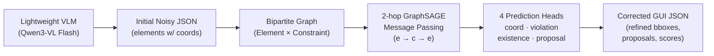

# Bipartite-GNN-GUI

**Heterogeneous Bipartite GNN for GUI Structure Error Correction**

*异构二分图神经网络用于 GUI 结构错误修正*

---

## Project Overview / 项目概述

**English**

Bipartite-GNN-GUI is a post-correction framework for GUI element parsing errors from lightweight Vision-Language Models (VLMs). Lightweight VLMs (Qwen3-VL Flash, MiniMax-VL-01) parse GUI screenshots into structured JSON quickly and cheaply, but suffer from two systematic failure modes:

- **Element omission** — 10–30% of visible elements are missed, especially small icons, dividers, and nested containers.
- **Misalignment** — bounding boxes of detected elements can deviate by 10–50+ pixels, breaking downstream layout reasoning.

The framework takes the noisy VLM JSON and treats GUI correction as **structured prediction on a heterogeneous bipartite graph**:

1. Elements become *element nodes*; extracted spatial relationships (alignment, containment, spacing, grid) become *constraint nodes*; edges only connect the two partitions.
2. Two hops of GraphSAGE message passing propagate constraint information to element nodes.
3. Four prediction heads read out: coordinate refinement Δ𝐱, constraint violation detection, element existence (reliability) scoring, and proposals for *missing* elements.

**中文**

Bipartite-GNN-GUI 是一个针对轻量级视觉语言模型 (VLM) GUI 元素解析错误的后修正框架。轻量级 VLM(如 Qwen3-VL Flash、MiniMax-VL-01)能快速廉价地将 GUI 截图解析为结构化 JSON,但存在两类系统性错误:

- **元素遗漏** — 10–30% 的可见元素被漏检,尤其是小图标、分割线和嵌套容器。
- **位置偏移** — 已检测元素的边界框可能偏离真实位置 10–50+ 像素,破坏下游布局推理。

框架接收含噪声的 VLM JSON,将 GUI 修正建模为**异构二分图上的结构化预测**:

1. 元素作为*元素节点*,提取的空间关系(对齐、包含、间距、网格)作为*约束节点*,边只存在于两个分区之间。
2. 两跳 GraphSAGE 消息传递将约束信息传播到元素节点。
3. 四个预测头分别输出:坐标修正量 Δ𝐱、约束违反检测、元素存在性(可靠性)打分、缺失元素提案。

---

## Method / 方法



### Graph Construction

A screenshot yields $N$ detected elements, each with a normalized bounding box and a type label. From these, $M$ spatial constraints are extracted — each constraint is a typed relationship between a source and a target set of elements, present when its predicate holds within a tolerance:

| Constraint | Meaning |
|---|---|
| `ALIGN_LEFT / RIGHT / TOP / BOTTOM` | Elements share a common edge |
| `CENTER_X / CENTER_Y` | Elements are horizontally/vertically centered |
| `SPACING` | Consistent gaps between consecutive items |
| `CONTAINMENT` | One element's box sits inside another's |
| `GRID` | Elements form a regular row/column grid |
| `SAME_SIZE` | Elements share width and/or height |

The resulting graph is bipartite by construction: $G = (V_e \cup V_c, E)$ with $E \subseteq V_e \times V_c$. Elements communicate only through the constraints they share — there are no element–element edges. Element node features are the normalized box coordinates plus area (optionally concatenated with a frozen visual feature); constraint node features embed the type one-hot plus spatial statistics of the participating elements.

### Message Passing

Two alternating GraphSAGE hops: *element → constraint* (each constraint aggregates its incident elements), then *constraint → element* (each element gathers the updated constraint states). After two hops, every element's representation carries information from all elements that share a constraint with it.

### Prediction Heads

The training objective is a weighted sum of four losses, $\mathcal{L} = w_c \mathcal{L}_{coord} + w_v \mathcal{L}_{vio} + w_e \mathcal{L}_{exist} + w_p \mathcal{L}_{prop}$:

| Head | Output | Loss |
|---|---|---|
| Coordinate refinement | per-element delta Δ𝐱ᵢ = (Δx, Δy, Δw, Δh) | smooth L1 |
| Violation detection | per-constraint violated / satisfied | binary cross-entropy |
| Existence scoring | per-element reliability score (hallucination filter) | binary cross-entropy |
| Element completion | box + type proposals for missing elements | IoU-based box loss + CE |

The completion head is **self-supervised**: during training a fraction of ground-truth elements is randomly dropped, and the head learns to propose them back from the dangling constraints they leave behind — no additional annotation required.

---

## Results / 实验结果

Reported on RICO (real Android screenshots) and ScreenSpot; details in [`docs/algorithm.md`](docs/algorithm.md) and the final report ([`report/`](report/)).

| Experiment | Result |
|---|---|
| Constraint violation detection (all 10 types) | 90–94% accuracy (0.908 full control) |
| Ablation: removing `CONTAINMENT` | −1.9 pp accuracy |
| Joint training objective | violation acc 0.876, proposal MSE 0.051 |
| Element completion @ high drop ratio (0.6 / 0.8) | IoU **+39% / +56%** vs nearest-neighbor baseline |
| End-to-end on 200 real Qwen3-VL Flash screenshots | F1 0.291 → **0.311** (+2.0 pp), recall +2.2 pp, precision +1.1 pp; **106 previously missed elements recovered** |
| Inference cost | 57K parameters, ~5 ms graph build, ~0.53 ms inference per screenshot (CPU) |

## Web Demo / 网页演示

A working interactive demo ships with the repo (`api/` FastAPI backend + `web/` single-page frontend):

- Five curated RICO cases with precomputed overlays (existence scoring + element completion)
- Upload your own screenshot and run the VLM → graph → GNN pipeline
- Endpoints: `/api/predict`, `/api/gnn-only`, `/api/cases`, `/api/demo/*`

```bash
pip install -e ".[demo]"
python api/main.py          # serves the frontend at http://localhost:8765
```

---

## Installation / 安装

```bash
git clone https://github.com/mrtsels/bipartite-gnn-gui.git
cd bipartite-gnn-gui
python -m venv venv && source venv/bin/activate

pip install -e .            # core package
pip install -e ".[test]"    # + test dependencies
pip install -e ".[demo]"    # + web demo (FastAPI)
```

Requires Python ≥ 3.10, PyTorch ≥ 2.1, and PyTorch Geometric ≥ 2.4. CPU-only inference is supported; training benefits from a GPU.

## Datasets / 数据集

| Dataset | Description | Use |
|---|---|---|
| **RICO** | Real Android screenshots with view-hierarchy annotations | Main training & evaluation |
| **ScreenSpot** | GUI grounding across mobile / web / desktop | Cross-domain evaluation |
| **GUI-360°** | Pixel-level annotated GUI screenshots | Optional, via download script |

`scripts/download_datasets.py` downloads GUI-360° and ScreenSpot from HuggingFace (requires `HF_TOKEN`).

## Project Structure / 项目结构

```
bipartite-gnn-gui/
├── src/bipartite_gnn_gui/     # package: data / graph / model / eval / utils
├── tests/                     # 942 tests (pytest)
├── scripts/                   # training, evaluation, data-prep scripts
├── experiments/               # experiment scripts and result JSONs
├── configs/                   # YAML experiment configs
├── api/                       # FastAPI backend for the web demo
├── web/                       # single-page frontend
├── demo_data/                 # precomputed demo cases and overlays
├── docs/
│   ├── algorithm.md           # mathematical formulation
│   ├── schema.md              # graph schema reference
│   ├── requirements/          # VLM / ground-truth data format specs
│   └── research/              # research directions
├── report/  report-cn/        # final report sources (EN / 中文)
├── poster/                    # conference poster
└── pyproject.toml
```

## Testing / 测试

```bash
pip install -e ".[test]"
pytest tests/ -v
```

## Citation / 引用

```bibtex
@software{bipartite_gnn_gui,
  title  = {Bipartite-GNN-GUI: Heterogeneous Bipartite GNN for GUI Structure Error Correction},
  author = {Xie, Licheng},
  year   = {2026},
  url    = {https://github.com/mrtsels/bipartite-gnn-gui}
}
```

## License / 许可证

MIT License — see [LICENSE](LICENSE).
