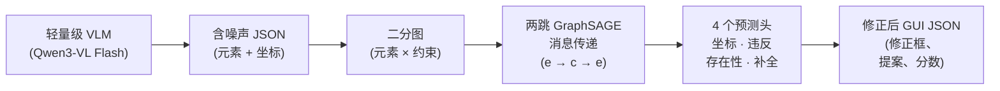

# Bipartite-GNN-GUI

**异构二分图神经网络用于 GUI 结构错误修正**

**简体中文** | [English](README.md)

---

## 项目概述

Bipartite-GNN-GUI 是一个针对轻量级视觉语言模型 (VLM) GUI 元素解析错误的后修正框架。轻量级 VLM(如 Qwen3-VL Flash、MiniMax-VL-01)能快速廉价地将 GUI 截图解析为结构化 JSON,但存在两类系统性错误:

- **元素遗漏** — 10–30% 的可见元素被漏检,尤其是小图标、分割线和嵌套容器。
- **位置偏移** — 已检测元素的边界框可能偏离真实位置 10–50+ 像素,破坏下游布局推理。

框架接收含噪声的 VLM JSON,将 GUI 修正建模为**异构二分图上的结构化预测**:

1. 元素作为*元素节点*,提取的空间关系(对齐、包含、间距、网格)作为*约束节点*,边只存在于两个分区之间。
2. 两跳 GraphSAGE 消息传递将约束信息传播到元素节点。
3. 四个预测头分别输出:坐标修正量 Δ𝐱、约束违反检测、元素存在性(可靠性)打分、缺失元素提案。

---

## 方法



### 图构建

一张截图产生 $N$ 个检测元素,每个元素带归一化边界框和类型标签。从中提取 $M$ 个空间约束——每个约束是源元素集与目标元素集之间的类型化关系,当其谓词在容差范围内成立时存在:

| 约束 | 含义 |
|---|---|
| `ALIGN_LEFT / RIGHT / TOP / BOTTOM` | 元素共享同一条边 |
| `CENTER_X / CENTER_Y` | 元素水平/垂直居中 |
| `SPACING` | 相邻元素间距一致 |
| `CONTAINMENT` | 一个元素的框包含在另一个内 |
| `GRID` | 元素构成规则的网格 |
| `SAME_SIZE` | 元素共享相同宽度/高度 |

图天然是二分的:$G = (V_e \cup V_c, E)$,其中 $E \subseteq V_e \times V_c$。元素只通过共享的约束通信——不存在元素–元素边。元素节点特征为归一化框坐标加面积(可选拼接冻结的视觉特征);约束节点特征为类型 one-hot 加参与元素的空间统计量。

### 消息传递

两跳交替 GraphSAGE:*元素 → 约束*(每个约束聚合其关联元素),再 *约束 → 元素*(每个元素收集更新后的约束状态)。两跳之后,每个元素的表示携带了所有与之共享约束的元素的信息。

### 预测头

训练目标为四个损失的加权和,$\mathcal{L} = w_c \mathcal{L}_{coord} + w_v \mathcal{L}_{vio} + w_e \mathcal{L}_{exist} + w_p \mathcal{L}_{prop}$:

| 预测头 | 输出 | 损失 |
|---|---|---|
| 坐标修正 | 每个元素的修正量 Δ𝐱ᵢ = (Δx, Δy, Δw, Δh) | smooth L1 |
| 违反检测 | 每个约束 违反/满足 | 二元交叉熵 |
| 存在性打分 | 每个元素的可靠性分数(幻觉过滤) | 二元交叉熵 |
| 元素补全 | 缺失元素的框 + 类型提案 | 基于 IoU 的框损失 + CE |

补全头是**自监督**的:训练时随机删除一部分真实元素,补全头从它们留下的悬空约束中学习如何重新提出这些元素——无需额外人工标注。

---

## 实验结果

实验基于 RICO(真实 Android 截图)与 ScreenSpot;详见 [`docs/algorithm.md`](docs/algorithm.md) 和终期报告([`report/`](report/))。

| 实验 | 结果 |
|---|---|
| 约束违反检测(全部 10 种类型) | 90–94% 准确率(全量 0.908) |
| 消融:移除 `CONTAINMENT` | 准确率 −1.9 pp |
| 联合训练目标 | violation acc 0.876, proposal MSE 0.051 |
| 元素补全(高缺失率 0.6 / 0.8) | IoU **+39% / +56%**(vs 最近邻基线) |
| 端到端 200 张真实 Qwen3-VL Flash 截图 | F1 0.291 → **0.311**(+2.0 pp),recall +2.2 pp,precision +1.1 pp;**恢复 106 个此前遗漏的元素** |
| 推理成本 | 57K 参数,~5 ms 图构建,~0.53 ms/图推理(CPU) |

## 网页演示

仓库附带可运行的交互式演示(`api/` FastAPI 后端 + `web/` 单页前端):

- 5 个精选 RICO 案例,含预计算叠加层(存在性打分 + 元素补全)
- 上传自己的截图,运行 VLM → 图 → GNN 全流程
- 端点:`/api/predict`、`/api/gnn-only`、`/api/cases`、`/api/demo/*`

```bash
pip install -e ".[demo]"
python api/main.py          # 在 http://localhost:8765 提供前端
```

---

## 安装

```bash
git clone https://github.com/mrtsels/bipartite-gnn-gui.git
cd bipartite-gnn-gui
python -m venv venv && source venv/bin/activate

pip install -e .            # 核心包
pip install -e ".[test]"    # + 测试依赖
pip install -e ".[demo]"    # + 网页演示 (FastAPI)
```

需要 Python ≥ 3.10、PyTorch ≥ 2.1、PyTorch Geometric ≥ 2.4。支持纯 CPU 推理;训练时 GPU 更佳。

## 数据集

| 数据集 | 描述 | 用途 |
|---|---|---|
| **RICO** | 真实 Android 截图,含视图层级标注 | 主要训练与评估 |
| **ScreenSpot** | 移动 / 网页 / 桌面跨端 GUI grounding | 跨域评估 |
| **GUI-360°** | 像素级标注的 GUI 截图 | 可选,通过下载脚本 |

`scripts/download_datasets.py` 从 HuggingFace 下载 GUI-360° 与 ScreenSpot(需要 `HF_TOKEN`)。

## 项目结构

```
bipartite-gnn-gui/
├── src/bipartite_gnn_gui/     # 包:data / graph / model / eval / utils
├── tests/                     # 942 个测试 (pytest)
├── scripts/                   # 训练、评估、数据准备脚本
├── experiments/               # 实验脚本与结果 JSON
├── configs/                   # YAML 实验配置
├── api/                       # 网页演示的 FastAPI 后端
├── web/                       # 单页前端
├── demo_data/                 # 预计算的演示案例与叠加层
├── docs/
│   ├── algorithm.md           # 数学表述
│   ├── schema.md              # 图 schema 参考
│   ├── requirements/          # VLM / 真实数据格式规范
│   └── research/              # 研究方向
├── report/                    # 终期报告源码
├── poster/                    # 会议海报
└── pyproject.toml
```

## 测试

```bash
pip install -e ".[test]"
pytest tests/ -v
```

## 引用

```bibtex
@software{bipartite_gnn_gui,
  title  = {Bipartite-GNN-GUI: Heterogeneous Bipartite GNN for GUI Structure Error Correction},
  author = {Xie, Licheng},
  year   = {2026},
  url    = {https://github.com/mrtsels/bipartite-gnn-gui}
}
```

## 许可证

MIT License — 见 [LICENSE](LICENSE)。
