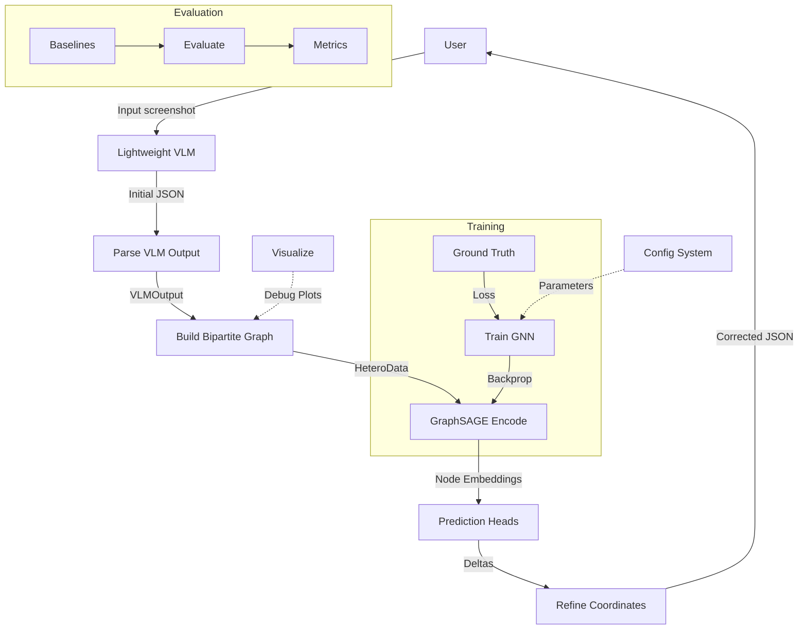

# 用例定义与核心功能规划 (Use Case & Core Function Planning)

## 1. Use Case Diagram (Mermaid)



## 2. Primary Flow (Inference Pipeline)

The inference pipeline transforms a raw UI screenshot into corrected element coordinates through
six sequential stages:

1.  **Screenshot → VLM**
    A lightweight Vision-Language Model (e.g., a fine-tuned Florence-2 or PaliGemma variant)
    receives the UI screenshot and produces an initial JSON description containing bounding
    boxes, text labels, and detected alignment relationships.

2.  **VLM → Parse**
    The `data/` module parses the VLM's raw JSON output into a structured `VLMOutput`
    dataclass. This step handles schema validation, coordinate normalization, and token-level
    confidence extraction.

3.  **Parse → Graph**
    The `graph/` module constructs a heterogeneous bipartite graph (`HeteroData`):
    - **Element nodes**: one per detected element, with features (center_x, center_y, w, h,
      text_embedding, confidence).
    - **Group nodes**: one per alignment group.
    - **Edges**: element→group (membership) and group→element (constraint influence).

4.  **Graph → Encode**
    A shared-weight GraphSAGE encoder processes both node types, producing d-dimensional
    embeddings that capture spatial and relational context. The two node types share the same
    encoder weights to leverage cross-type signal.

5.  **Encode → Predict**
    Prediction heads take the encoded node embeddings and output per-element coordinate
    deltas (Δcx, Δcy, Δw, Δh). The heads are lightweight MLPs trained to predict the residual
    between VLM output and ground truth.

6.  **Predict → Refine**
    The `model/` module applies the predicted deltas to the original VLM coordinates,
    producing the final corrected JSON. This output is structurally identical to the VLM input
    but with refined bounding boxes.

## 3. Secondary Flows

### 3.1 Training

```
Ground Truth → DataLoader → Graph → Model → Loss → Backprop
```

- **Input**: Paired (screenshot, ground-truth annotation) samples.
- **DataLoader**: Pairs `VLMOutput` (generated offline) with corresponding `GroundTruth`
  annotations.
- **Graph**: Same construction as inference, using VLM predictions as source nodes and GT as
  targets.
- **Model**: Shared GraphSAGE encoder + prediction heads.
- **Loss**: Multi-component loss = λ₁ · position_loss + λ₂ · size_loss + λ₃ ·
  alignment_loss + λ₄ · existence_loss.
- **Backprop**: Standard gradient descent with configurable optimizer (Adam/AdamW), learning
  rate schedule (cosine annealing with warmup), and gradient clipping.

### 3.2 Evaluation

```
Predictions + GT → Metrics → Report
```

- **Input**: Model predictions on a held-out test set, plus corresponding ground truth.
- **Metrics**: All metrics defined in [metrics.md](./metrics.md) are computed.
- **Report**: Console output (table format) and optional JSON dump.

### 3.3 Visualization

```
Graph structure → Matplotlib overlay → Debug plots
```

- Overlays the bipartite graph structure on the original screenshot.
- Element nodes drawn as bounding boxes; group nodes as dashed regions.
- Edge colors indicate predicted correction direction and magnitude.
- Used for qualitative debugging and paper figures.

### 3.4 Configuration

```
YAML config → all modules
```

A single YAML configuration file controls all hyperparameters and paths:
- Model architecture (hidden dims, layers, dropout)
- Training (lr, batch size, epochs, loss weights)
- Data (paths, splits, augmentation)
- Evaluation (metrics, bootstrap iterations)
- Logging (wandb project, checkpoint frequency)

## 4. Module Boundaries & Data Contracts

| Module  | Input                         | Output                              |
|---------|-------------------------------|--------------------------------------|
| data/   | Raw JSON (VLM), JSON (GT)    | `VLMOutput`, `GroundTruth`           |
| graph/  | `VLMOutput`, `GroundTruth`    | `HeteroData` (PyG)                  |
| model/  | `HeteroData` (PyG)            | Corrected JSON, `VLMOutput` (refined)|
| eval/   | Predicted `VLMOutput`, `GroundTruth` | `Dict[str, float]` (metrics)   |
| utils/  | YAML config file              | Config dataclass/namedtuple objects  |

### Data Contract Details

**VLMOutput** (from data/)
- `elements: List[Element]` where each `Element` has:
  - `bbox: Tuple[float, float, float, float]`  (cx, cy, w, h), normalized [0, 1]
  - `text: str`
  - `group_ids: List[int]`
  - `confidence: float`

**GroundTruth** (from data/)
- `elements: List[GTElement]` where each `GTElement` has:
  - `bbox: Tuple[float, float, float, float]`  (cx, cy, w, h), normalized [0, 1]
  - `text: str`
  - `group_ids: List[int]`
  - `vlm_match_idx: Optional[int]`  (index into corresponding VLMOutput.elements)

**HeteroData** (from graph/)
- PyTorch Geometric `HeteroData` object with:
  - `node_types: ["element", "group"]`
  - `edge_types: [("element", "belongs_to", "group"), ("group", "constrains", "element")]`
  - `element.x: Tensor[N_e, d_feat]`
  - `group.x: Tensor[N_g, d_feat]`

**Corrected JSON** (from model/)
- Same schema as the VLM input JSON, with refined bbox fields.
